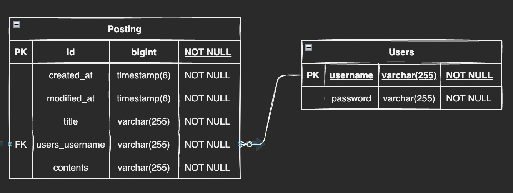
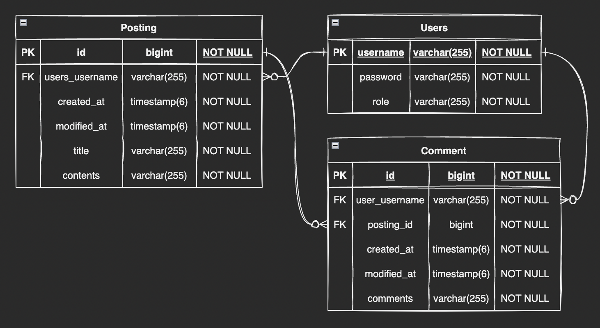

# Spring 입문 강의 개인 과제

## 블로그 백엔드 서버 만들기
___

___
### 주의사항
- Entity를 그대로 반환하지 말고, DTO에 담아서 반환
___
## 요구사항
### 1. 아래의 요구사항을 기반으로 Use Case 그려보기

### 2. 전체 게시글 목록 조회 API
- 제목, 작성자명, 작성내용, 작성날짜를 조회하기
- 작성날짜 기준 내림차순으로 정렬하기
### 3. 게시글 작성 API
- 제목, 작성자명, 비밀번호, 작성내용을 저장하고
- 저장된 게시글을 Client로 반환하기
### 4. 선택한 게시글 조회 API
- 선택한 게시글의 제목, 작성자명, 작성날짜, 작성내용을 조회하기
  (검색 기능 아님. 간단한 게시글 조회만 구현)
### 5. 선택한 게시글 수정 API
- 수정을 요청할 때 수정할 데이터와 비밀번호를 같이 보내서 서버에서 비밀번호 일치여부를 확인한 후
- 제목, 작성자명, 작성내용을 수정하고 수정된 게시글을 Client로 반환하기
### 6. 선택한 게시글 삭제 API
- 삭제를 요청할 때 비밀번호를 같이 보내서 서버에서 비밀번호 일치여부 확인한 후
- 선택한 게시글을 삭제하고 Client로 성공했다는 표시 반환하기
___
## API 명세서

| 기능                    | Method   | URL           | Request                                        | Response                                                       |
|-----------------------|----------|---------------|------------------------------------------------|----------------------------------------------------------------|
| 게시글 생성                | `POST`   | /posting      | title contents writerName password | title writerName password contents                 |
| 전체 게시글 조회             | `GET`    | /postings     | -                                              | createdAt modifiedAt title writerName contents |
| 게시글 조회 (id)       | `GET`    | /posting/id   | -                                              | createdAt modifiedAt title writerName contents |
| 게시글 조회 (username) | `GET`    | /posting/name | -                                              | createdAt modifiedAt title writerName contents |
| 게시글 수정                | `PUT`    | /posting/{id} | title2 contents2 writerName2           |                                                                |
| 게시글 삭제                | `DELETE` | /posting/{id} | -                                              |                                                                |

___
 
 
 
----------------------------------------------------------여백----------------------------------------------------------
 
 
 

---

# Spring 숙련 강의 개인과제 Lv.1

## 회원가입, 로그인 기능이 추가된 블로그 백엔드 서버 만들기

___

### 주의사항
- 요구사항에 맞게 추가되어야 하는 Entity를 설계하고 ERD를 만들어 볼 것
- 입문 강의 개인 과제에 회원가입, 로그인 기능을 추가하고 기존 요구사항의 일부를 변경

## 새로운 요구사항
### 1. 회원가입 API
- username, password를 Client에서 전달받기
- username은 `최소 4자 이상, 10자 이하이며 알파벳 소문자, 숫자`로 구성
- password는 `최소 8자 이상, 15자 이하이며 알파벳 대소문자, 숫자`로 구성
- DB에 중복된 username이 없다면 회원을 저장하고 Client로 성공 메시지, 상태코드 반환
### 2. 로그인 API
- username, password를 Client에서 전달받기
- DB에서 username을 사용하여 저장된 회원의 유무를 확인하고 있다면 password 비교하기
- 로그인 성공시, 로그인에 성공한 유저의 정보와 JWT를 활용하여 토큰을 발급하고,  
  발급한 토큰을 Header에 추가하고 성공 메시지, 상태코드 반환

___

## 기존 요구사항
### 1. 전체 게시글 목록 조회 API
- 제목, 작성자명(`username`), 작성내용, 작성날짜를 조회하기
- 작성날짜 기준 내림차순으로 정렬하기
### 2. 게시글 작성 API
- `토큰을 검사하여, 유효한 토큰일 경우에만 게시글 작성 가능`
- `제목, 작성자명(username), 작성 내용을 저장하고`
- 저장된 게시글을 Client로 반환
### 3. 선택한 게시글 조회 API
- 선택한 게시글의 제목, 작성자명(`username`), 작성날짜, 작성내용을 조회하기
  (검색 기능 아님. 간단한 게시글 조회만 구현)
### 4. 선택한 게시글 수정 API
- ~~수정을 요청할 때 수정할 데이터와 비밀번호를 같이 보내서 서버에서 비밀번호 일치여부를 확인한 후~~
- `토큰을 검사한 후, 유효한 토큰이면서 해당 사용자가 작성한 게시글만 수정 가능`
- `제목, 작성내용을 수정하고` 수정된 게시글을 Client로 반환
### 5. 선택한 게시글 삭제 API
- ~~삭제를 요청할 때 수정할 데이터와 비밀번호를 같이 보내서 서버에서 비밀번호 일치여부를 확인한 후~~
- `토큰을 검사한 후, 유효한 토큰이면서 해당 사용자가 작성한 게시글만 삭제 가능`
- 선택한 게시글을 삭제하고 Client로 성공 메시지, 상태코드 반환

___

## API 명세서

| 기능                    | Method   | URL            | Request               | Request Header  | Response                                                           | Response Header |
|-----------------------|----------|----------------|-----------------------|---------------------|--------------------------------------------------------------------|---------------------|
| 회원가입                  | `POST`   | /user/signup   | username password | -                   | status message                                                 | -                   |
| 로그인                   | `POST`   | /user/login    | username password | -                   | status message                                                 | Authorization : jwt |
| 게시글 작성                | `POST`   | /postings      | title contents    | Authorization : jwt | createAt modifiedAt id title username contents | -                   |
| 전체 게시글 조회             | `GET`    | /postings      | -                     | -                   | createAt modifiedAt id title username contents | -                   |
| 게시글 조회 (id)       | `GET`    | /postings/id   | id                    | -                   | createAt modifiedAt id title username contents | -                   |
| 게시글 조회 (username) | `GET`    | /postings/name | username              | -                   | createAt modifiedAt id title username contents | -                   |
| 게시글 수정                | `PUT`    | /postings/{id} | title contents    | Authorization : jwt | id title username contents                             | -                   |
| 게시글 삭제                | `DELETE` | /postings/{id} | -                     | Authorization : jwt | status message                                                 | -                   |

___

## ERD

___

 
 
 
----------------------------------------------------------여백----------------------------------------------------------
 
 
 

---

# Spring 숙련 강의 과제 Lv.2

## 댓글 작성/조회/수정/삭제 기능이 추가된 블로그 백엔드 서버 만들기

___

## 추가된 요구사항
### 1. 회원가입 API
- username, password 를 Client 에서 전달받기
- username 은 `최소 4자 이상, 10자 이하이며 알파벳 소문자, 숫자`로 구성
- password 는 `최소 8자 이상, 15자 이하이며 알파벳 대소문자, 숫자`, `특수문자`로 구성
- DB에 중복된 username 이 없다면 회원을 저장하고 Client 로 성공 메시지, 상태코드 반환
- `회원 권한 부여하기 (ADMIN, USER) - ADMIN 회원은 모든 게시글, 댓글 수정/삭제 가능`
### 2. 로그인 API
- username, password 를 Client 에서 전달받기
- DB 에서 username 을 사용하여 저장된 회원의 유무를 확인하고 있다면 password 비교하기
- 로그인 성공시, 로그인에 성공한 유저의 정보와 JWT 를 활용하여 토큰을 발급하고, 
  발급한 토큰을 Header 에 추가하고 성공 메시지, 상태코드 반환
### 3. `댓글 작성 API`
- 토큰을 검사한 후, 유효한 토큰인 경우에만 댓글 작성 가능
- 선택한 게시글의 DB 저장 유무 확인
- 선택한 게시글이 있다면 댓글을 등록하고 등록된 댓글 반환
### 4. `댓글 수정 API`
- 토큰을 검사한 후, 유효한 토큰이면서 해당 사용자가 작성한 댓글만 수정 가능
- 선택한 댓글의 DB 저장 유무 확인
- 선택한 댓글이 있다면 댓글 수정하고 수정된 댓글 반환
### 5. `댓글 삭제 API`
- 토큰을 검사한 후, 유효한 토큰이면서 해당 사용자가 작성한 댓글만 삭제 가능
- 선택한 댓글의 DB 저장 유무 확인
- 선택한 댓글이 있다면 댓글 삭제하고 Client 로 성공했다는 메시지, 상태코드 반환
### 6. `예외 처리`
- 토큰이 필요한 API 요청에서 토큰을 전달하지 않았거나 정상 토큰이 아닌 경우  
  - "토큰이 유효하지 않습니다." 라는 에러메시지와 statusCode : 400을 Client에 반환
- 토큰이 있고, 유효한 토큰이지만 해당 사용자가 작성한 게시글/댓글이 아닌 경우  
  - "작성자만 삭제/수정 할 수 있습니다." 라는 에러메시지와 statusCode : 400을 Client에 반환
- DB에 이미 존재하는 username으로 회원가입을 요청한 경우  
  - "중복된 username 입니다." 라는 에러메시지와 statusCode : 400을 Client에 반환
- 로그인 시, 전달된 username과 password 중 맞지 않는 정보가 있는 경우  
  - "회원을 찾을 수 없습니다."라는 에러메시지와 statusCode : 400을 Client에 반환

___

## 기존 요구사항
### 1. 전체 게시글 목록 조회 API
- 제목, 작성자명(username), 작성내용, 작성날짜를 조회하기
- 작성날짜 기준 내림차순으로 정렬하기
- `각각의 게시글에 등록된 모든 댓글을 게시글과 같이 Client에 반환`
- `댓글은 작성 날짜 기준 내림차순으로 정렬`
### 2. 게시글 작성 API
- 토큰을 검사하여, 유효한 토큰일 경우에만 게시글 작성 가능
- 제목, 작성자명(username), 작성 내용을 저장하고
- 저장된 게시글을 Client로 반환
### 3. 선택한 게시글 조회 API
- 선택한 게시글의 제목, 작성자명(username), 작성날짜, 작성내용을 조회하기 
  (검색 기능 아님. 간단한 게시글 조회만 구현)
- `선택한 게시글에 등록된 모든 댓글을 선택한 게시글과 같이 Client에 반환`
- `댓글은 작성 날짜 기준 내림차순으로 정렬`
### 4. 선택한 게시글 수정 API
- ~~수정을 요청할 때 수정할 데이터와 비밀번호를 같이 보내서 서버에서 비밀번호 일치여부를 확인한 후~~
- 토큰을 검사한 후, 유효한 토큰이면서 해당 사용자가 작성한 게시글만 수정 가능
- 제목, 작성내용을 수정하고 수정된 게시글을 Client로 반환
### 5. 선택한 게시글 삭제 API
- ~~삭제를 요청할 때 수정할 데이터와 비밀번호를 같이 보내서 서버에서 비밀번호 일치여부를 확인한 후~~
- 토큰을 검사한 후, 유효한 토큰이면서 해당 사용자가 작성한 게시글만 삭제 가능
- 선택한 게시글을 삭제하고 Client로 성공 메시지, 상태코드 반환

___

## API 명세서
| 기능                    | Method   | URL                                 | Request               | Request Header  | Response                                                                           | Response Header |
|-----------------------|----------|-------------------------------------|-----------------------|---------------------|------------------------------------------------------------------------------------|---------------------|
| 회원가입                  | `POST`   | /signup                             | username password |                     | status message                                                                 |                     |
| 로그인                   | `POST`   | /login                              | username password |                     | status message                                                                 | Authorization : jwt |
| 게시글 작성                | `POST`   | /posts                              | title contents    | Authorization : jwt | id title username contents                                             |                     |
| 전체 게시글 조회             | `GET`    | /posts                              | -                     |                     | createAt modifiedAt id title username contents commentList |                     |
| 게시글 조회 (id)       | `GET`    | /posts/id?id=1                      | id                    |                     | createAt modifiedAt id title username contents commentList |                     |
| 게시글 조회 (username) | `GET`    | /posts                              | username              |                     | createAt modifiedAt id title username contents commentList |                     |
| 게시글 수정                | `PUT`    | /posts/{id}                         | title contents    | Authorization : jwt | id title username contents                                             |                     |
| 게시글 수정 (Admin)        | `PUT`    | /admin/posts/{id}                   | title contents    | Authorization : jwt | id title username contents                                             |                     |
| 게시글 삭제                | `DELETE` | /posts/{id}                         | -                     | Authorization : jwt | status message                                                                 |                     |
| 게시글 삭제 (Admin)        | `DELETE` | /admin/posts/{id}                   | -                     | Authorization : jwt | status message                                                                 |                     |
| 댓글 작성                 | `POST`   | /posts/{postId}/comments            | comment               | Authorization : jwt | id createdAt modifiedAt username comment                           |                     |
| 댓글 수정                 | `PUT`    | /posts/{postId}/comments/{id}       | comment               | Authorization : jwt | id createdAt modifiedAt username comment                           |                     |
| 댓글 수정 (Admin)         | `PUT`    | /admin/posts/{postId}/comments/{id} | comment               | Authorization : jwt | id createdAt modifiedAt username comment                           |                     |
| 댓글 삭제                 | `DELETE` | /posts/{postId}/comments/{id}       |                       | Authorization : jwt | status message                                                                 |                     |
| 댓글 삭제 (Admin)         | `DELETE` | /admin/posts/{postId}/comments/{id} |                       | Authorization : jwt | status message                                                                 |                     |

---

## ERD

---

# Spring 심화 강의 과제 Lv.2

## Spring Security를 적용한 블로그 백엔드 서버 만들기

## 추가된 요구사항
### 1. 숙련강의 개인과제 Lv2 프로젝트에 `Spring Security` 적용하기
### 2. 게시글 좋아요 API
- 사용자는 선택한 게시글에 '좋아요'를 할 수 있다.
- 사용자가 이미 '좋아요'한 게시글에 다시 '좋아요' 요청을 하면 '좋아요'를 했던 기록이 취소된다.
- 요청이 성공하면 Client로 성공했다는 메시지, 상태코드 반환
### 3. 댓글 좋아요 API
- 사용자는 선택한 댓글에 '좋아요'를 할 수 있다.
- 사용자가 이미 '좋아요'한 댓글에 다시 '좋아요' 요청을 하면 '좋아요'룰 했던 기록이 취소된다.
- 요청이 성공하면 Client로 성공했다는 메시지, 상태코드 반환
### 4. 예외처리
- 아래의 예외처리를 AOP를 활용하여 구현

## 기존 요구사항
### 1. 회원 가입 API
- username, password 를 Client 에서 전달받기
- username 은 `최소 4자 이상, 10자 이하이며 알파벳 소문자, 숫자`로 구성
- password 는 `최소 8자 이상, 15자 이하이며 알파벳 대소문자, 숫자`, `특수문자`로 구성
- DB에 중복된 username 이 없다면 회원을 저장하고 Client 로 성공 메시지, 상태코드 반환
- 회원 권한 부여하기 (ADMIN, USER) - ADMIN 회원은 모든 게시글, 댓글 수정/삭제 가능
### 2. 로그인 API
- username, password 를 Client 에서 전달받기
- DB 에서 username 을 사용하여 저장된 회원의 유무를 확인하고 있다면 password 비교하기
- 로그인 성공시, 로그인에 성공한 유저의 정보와 JWT 를 활용하여 토큰을 발급하고, 
  발급한 토큰을 Header 에 추가하고 성공 메시지, 상태코드 반환
### 3. 전체 게시글 목록 조회 API
- 제목, 작성자명(username), 작성내용, 작성날짜를 조회하기
- 작성날짜 기준 내림차순으로 정렬하기
- 각각의 게시글에 등록된 모든 댓글을 게시글과 같이 Client에 반환
- 댓글은 작성 날짜 기준 내림차순으로 정렬
- `게시글 / 댓글에 '좋아요' 갯수도 함께 반환`
### 4. 게시글 작성 API
- ~~토큰을 검사하여, 유효한 토큰일 경우에만 게시글 작성 가능~~ 
  -> `Spring Security를 사용하여 토큰 검사 및 인증`
- 제목, 작성자명(username), 작성 내용을 저장하고
- 저장된 게시글을 Client로 반환
- ### 5. 선택한 게시글 조회 API
- 선택한 게시글의 제목, 작성자명(username), 작성날짜, 작성내용을 조회하기 
  (검색 기능 아님. 간단한 게시글 조회만 구현)
- 선택한 게시글에 등록된 모든 댓글을 선택한 게시글과 같이 Client에 반환
- 댓글은 작성 날짜 기준 내림차순으로 정렬
- `게시글 / 댓글에 '좋아요' 갯수도 함께 반환`
### 6. 선택한 게시글 수정 API
- ~~토큰을 검사한 후, 유효한 토큰이면서 해당 사용자가 작성한 게시글만 수정 가능~~ 
  -> `Spring Security를 사용하여 토큰 검사 및 인증`
- 제목, 작성내용을 수정하고 수정된 게시글을 Client로 반환
- 게시글에 '좋아요' 갯수도 함께 반환
### 7. 선택한 게시글 삭제 API
- ~~토큰을 검사한 후, 유효한 토큰이면서 해당 사용자가 작성한 게시글만 삭제 가능~~ 
  -> `Spring Security를 사용하여 토큰 검사 및 인증`
- 선택한 게시글을 삭제하고 Client로 성공 메시지, 상태코드 반환
### 8. 댓글 작성 API
- ~~토큰을 검사한 후, 유효한 토큰인 경우에만 댓글 작성 가능~~ 
  -> `Spring Security를 사용하여 토큰 검사 및 인증`
- 선택한 게시글의 DB 저장 유무 확인
- 선택한 게시글이 있다면 댓글을 등록하고 등록된 댓글 반환
### 9. 댓글 수정 API
- ~~토큰을 검사한 후, 유효한 토큰이면서 해당 사용자가 작성한 댓글만 수정 가능~~ 
  -> `Spring Security를 사용하여 토큰 검사 및 인증`
- 선택한 댓글의 DB 저장 유무 확인
- 선택한 댓글이 있다면 댓글 수정하고 수정된 댓글 반환
### 10. 댓글 삭제 API
- ~~토큰을 검사한 후, 유효한 토큰이면서 해당 사용자가 작성한 댓글만 삭제 가능~~ 
  -> `Spring Security를 사용하여 토큰 검사 및 인증`
- 선택한 댓글의 DB 저장 유무 확인
- 선택한 댓글이 있다면 댓글 삭제하고 Client 로 성공했다는 메시지, 상태코드 반환
### 11. `예외 처리`
- 토큰이 필요한 API 요청에서 토큰을 전달하지 않았거나 정상 토큰이 아닌 경우 
  - "토큰이 유효하지 않습니다." 라는 에러메시지와 statusCode : 400을 Client에 반환
- 토큰이 있고, 유효한 토큰이지만 해당 사용자가 작성한 게시글/댓글이 아닌 경우  
  - "작성자만 삭제/수정 할 수 있습니다." 라는 에러메시지와 statusCode : 400을 Client에 반환
- DB에 이미 존재하는 username으로 회원가입을 요청한 경우  
  - "중복된 username 입니다." 라는 에러메시지와 statusCode : 400을 Client에 반환
- 로그인 시, 전달된 username과 password 중 맞지 않는 정보가 있는 경우  
  - "회원을 찾을 수 없습니다."라는 에러메시지와 statusCode : 400을 Client에 반환
- `회원가입 시 username과 password의 구성이 알맞지 않은 경우`  
  - `에러메시지와 statusCode : 400을 Client에 반환`

---

